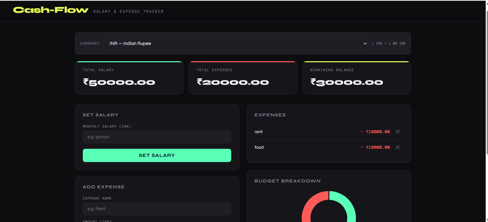

# 💸 Cash-Flow — Salary & Expense Tracker

A personal finance tracker I built using plain HTML, CSS, and JavaScript. No frameworks, no build tools — just open `index.html` in a browser and it works.

---

## 📌 About the Project

Cash-Flow is a browser-based dashboard where you can enter your monthly salary, add your expenses one by one, and instantly see how much money you have left. I built this to practice JavaScript logic, DOM manipulation, and working with browser storage.

---

## ✨ What It Does

- Set your monthly salary and see it displayed on the dashboard
- Add expenses with a name and amount
- Remaining balance updates automatically in real time
- Each expense appears in a list with a delete button
- A pie chart shows each expense as a separate colored slice alongside your remaining balance
- All data is saved in the browser — refreshing the page keeps everything intact
- Switch the display currency between INR, USD, EUR, GBP, JPY, and AED with live conversion
- Download a PDF report of your expenses and balance
- If your balance drops below 10% of your salary, the balance turns red and shows a warning

---

## 🗂️ Files

```
cash-flow-tracker/
├── index.html    # The whole app
├── README.md     # This file
└── Prompts.md    # Prompts used during development
```

---

## 🚀 How to Run

1. Download or clone this repository
2. Open `index.html` in any browser
3. That's it — no installation needed

---

## 🧠 What I Learned

- How to read and manipulate the DOM using `document.getElementById` and `createElement`
- Why inputs return strings by default and how to fix it with `parseFloat()`
- How `localStorage` works and why you need `JSON.stringify` and `JSON.parse`
- How to fetch live data from an external API using `async/await`
- How to generate a downloadable PDF from JavaScript

---

## 👤 Author

Sayyad Aafrin
Prodesk IT Internship — Week 2

## Project Screenshot


